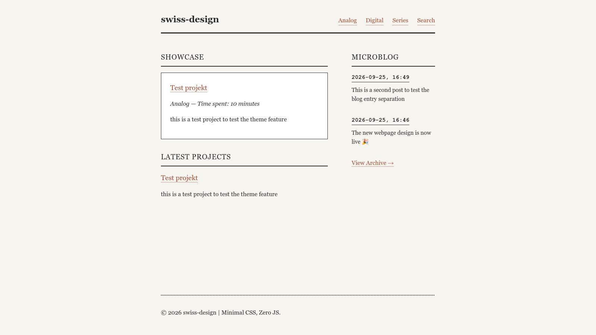
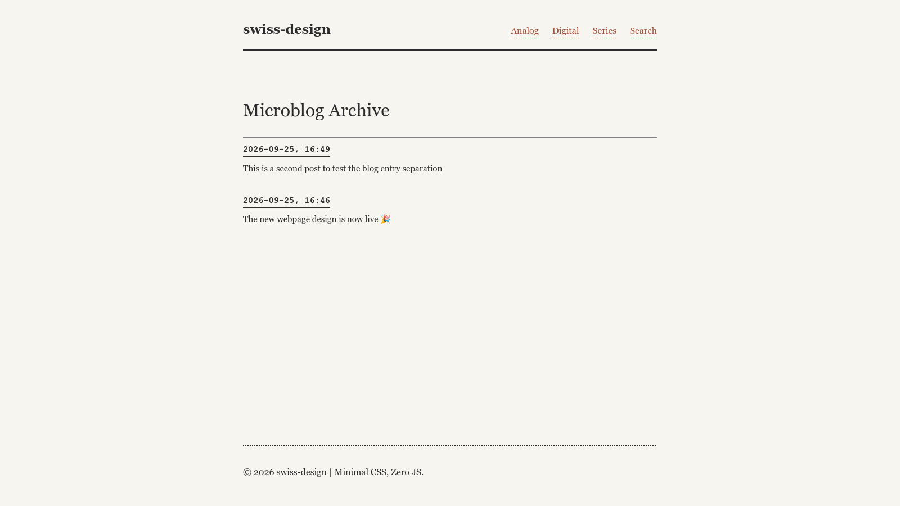
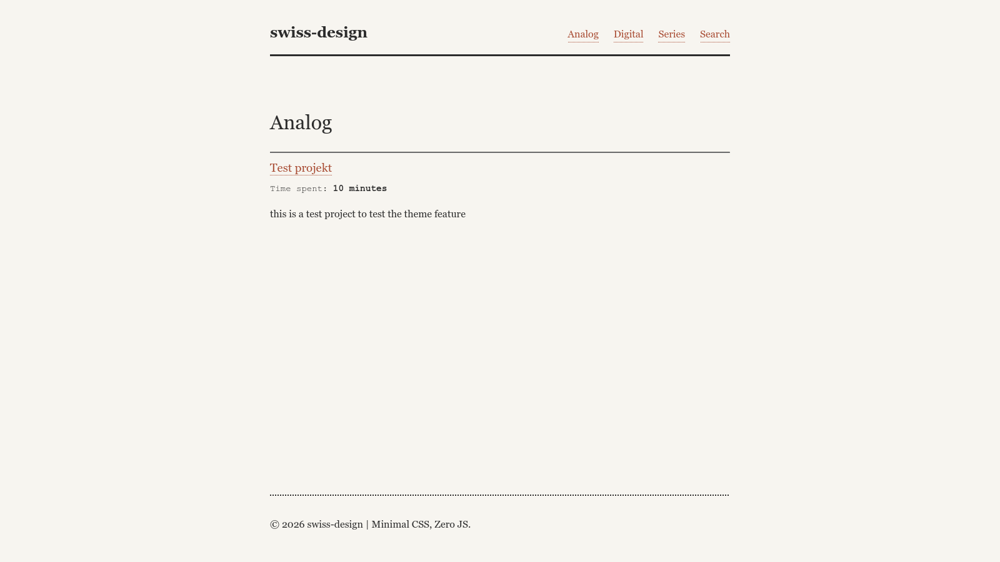
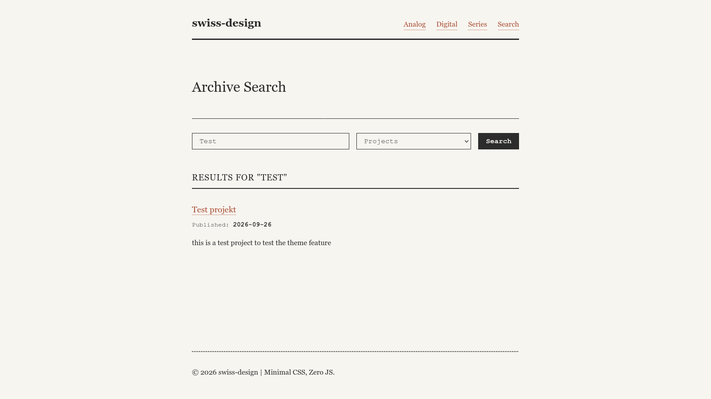
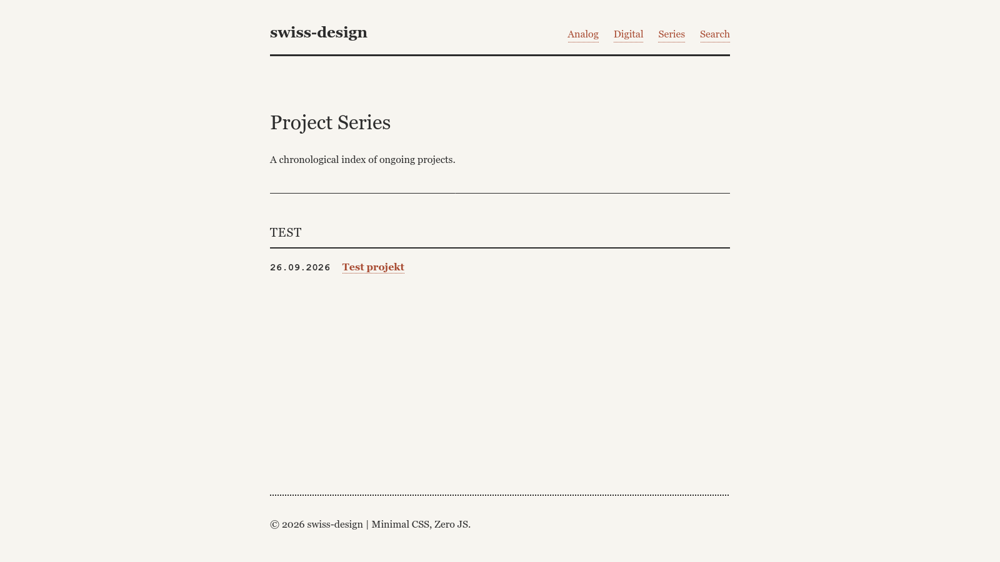
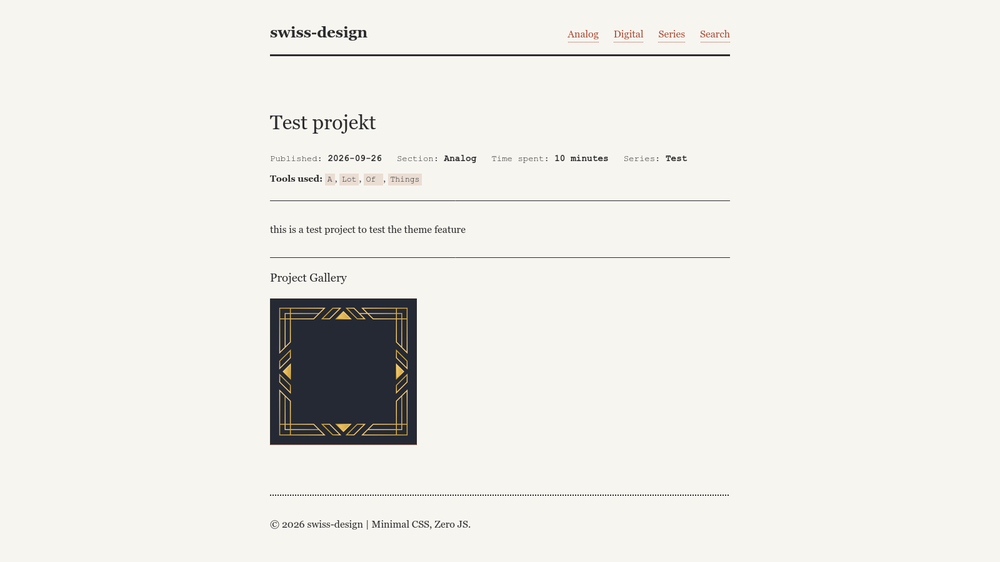
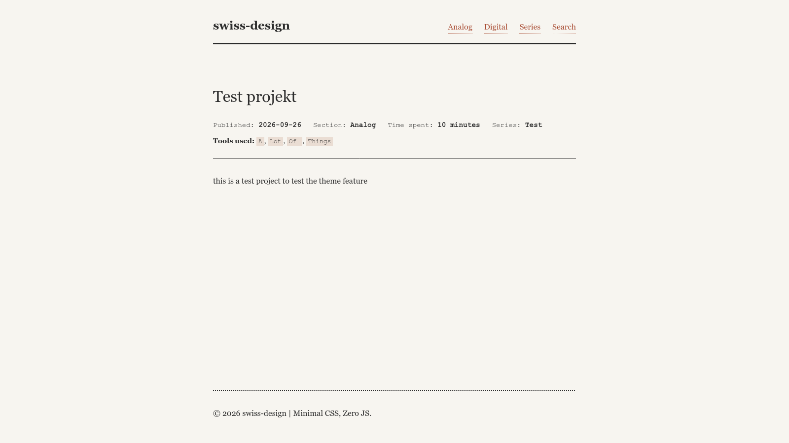

# grav-swiss-design-template

A clean and simple no js twig theme for [Grav 2](https://github.com/getgrav/grav) inspired by old manuals and the swiss design language.

### Screenshots

Homepage


Microblog Archive


Category Overview


Search Page


Series Overview


Project With Gallery


Project without Gallery


### Expected layout

```
/ (Site Root)
│
├── Home                (/home)                 [Template: home]
│
├── Analog              (/analog)               [Template: category]
│   │
│   ├── Project 1       (/analog/project1)      [Template: project]
│   └── Project 2       (/analog/project2)      [Template: project]
│
├── Digital             (/digital)              [Template: category]
│   │
│   ├── Project 3       (/digital/project3)     [Template: project]
│   └── Project 4       (/digital/project4)     [Template: project]
│
├── Microblog           (/microblog)            [Template: microblog]
│   │
│   ├── Update 1        (/microblog/update-1)   [Template: default]
│   └── Update 2        (/microblog/update-2)   [Template: default]
│
├── Series              (/series)               [Template: series]
│
├── Search              (/search)               [Template: search]
│
└── Error               (System routed)         [Template: error]
```

### Templates

- `home`: Pulls latest/featured projects and recent micro-posts.

- `category`: Lists all child projects within that specific folder.

- `project`: Custom blueprint layout with Tools, Time Spent, and Series metadata.

- `microblog`: Paginates all child posts inside the /microblog folder.

- `default`: Standard Grav text page, used for individual microblog updates.

- `series`: Automatically groups all projects site-wide by their series tag.

- `search`: Native query page for projects and micro-posts.

- `error`: Error page.

### Project Blueprint (Frontmatter Variables)

When creating a new page using the **Project** template, the following custom metadata fields are available in the Admin Panel (or directly via YAML).

*   **Category (`taxonomy.category`):** 
    This dictates which overview page the project appears on. All different categories are compiled and shown in the navbar
*   **Featured in Showcase (`featured`):** 
    Setting this to `true` (or `1` in the Admin Panel toggle) pins the project to the **Showcase** block on the Homepage. It will still appear in its standard category folder and the "Latest" feed.
*   **Series (`taxonomy.series`):** 
    Grouping name for related projects (e.g., `Custom OS`). Any project with this field filled out will automatically be grouped chronologically on the `/series` overview page.
*   **Time Spent (`time_spent`):** 
    Optional text string (e.g., `14 hours`, `2 weeks`). Renders in the metadata header. If left blank, the label hides itself automatically.
*   **Tools Used (`tools`):** 
    A list array of tools, languages, or materials (e.g., `Box Cutter`, `Watercolors`). Renders as monospace tags at the bottom of the header.
*   **Append Gallery (`show_gallery`):** 
    If toggled to `true`, any image files uploaded to the project folder will automatically render in a CSS grid at the very bottom of the post.

#### Example YAML Frontmatter for a Featured Project:

```yaml
title: 'Custom OS: Bootloader'
visible: false
featured: true
show_gallery: false
time_spent: '3 Weeks'
taxonomy:
    category: [digital]
    series: 'Custom OS'
tools:
    - name: C++
    - name: Assembly
    - name: QEMU

### Needed Frontmatter

#### Microblog

```yaml
title: 'Microblog'
visible: false
content:
    items: '@self.children'
    limit: 10           # Items per page
    order:
        by: date
        dir: desc
    pagination: true
```

#### Category

```yaml
title: 'CatName'
visible: true
content:
    items: '@self.children'
    order:
        by: date
        dir: desc
```